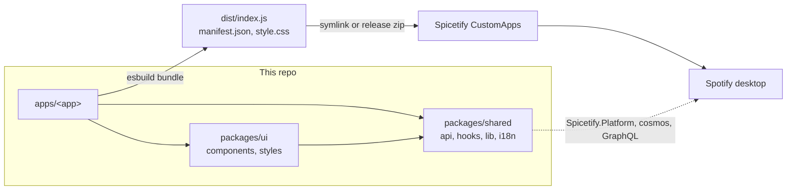
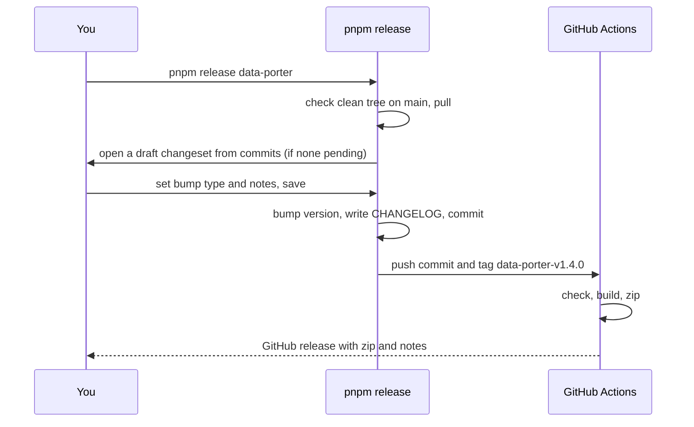

# Developer guide

Build, test and ship Spicetify apps from this repo. Each app is thin. Reusable code lives in `packages/`, so your next app starts with most of the work done.

**Contents:** [Quick start](#quick-start) · [How it fits](#how-it-fits) · [Repo map](#repo-map) · [Make an app](#make-an-app) · [Building blocks](#building-blocks) · [Rules](#rules) · [Translations](#translations) · [Styling](#styling) · [Tests](#tests) · [Release](#release) · [Fork](#fork) · [Troubleshooting](#troubleshooting)

## Quick start

You need Node.js 22+, pnpm 11+ and [Spicetify](https://spicetify.app/docs/advanced-usage/installation).

```sh
pnpm install
pnpm dev
```

`pnpm dev` links every app into Spotify, starts Spotify with DevTools on port 9222, and rebuilds on save. Spotify reloads by itself.

| Task                         | Command                |
| ---------------------------- | ---------------------- |
| Develop with live reload     | `pnpm dev`             |
| Build all apps and link them | `pnpm build`           |
| Build one app                | `pnpm build:app <app>` |
| Run every check              | `pnpm precommit`       |
| Fix formatting               | `pnpm format`          |
| Start a new app              | `pnpm create-app`      |
| Release an app               | `pnpm release <app>`   |
| Install the released build   | `pnpm download [app]`  |
| Point a fork at your repo    | `pnpm setup-fork`      |

`pnpm precommit` runs four checks: prettier, lint (warnings fail), typecheck and tests. The git hook runs it on each commit.

## How it fits



- **React comes from Spotify.** esbuild maps `react` to `Spicetify.React` (React 18). Never add `react` as a dependency.
- **Shared code ships inside each bundle.** A change in `packages/` reaches every app on its next release.

## Repo map

```
apps/<app>/src/        index.tsx (entry), app.tsx, components/, hooks/, services/, i18n/, styles/
packages/shared/src/   api/, hooks/, lib/, i18n/, types/, styles/     no UI
packages/ui/src/       components/, styles/, lib/, i18n/              shared UI
scripts/               build, dev, release, create-app, setup-fork
scripts/app-template/  what create-app copies; app.tsx is the wiring reference
manifest.json          one entry per app, read by the Spicetify Marketplace
```

## Make an app

1. Run `pnpm create-app`. Give a slug, a name, a description and tags.
2. Run `pnpm dev`. The app appears in the Spotify sidebar.
3. Replace the demo in `apps/<slug>/src/app.tsx`. The demo counts your Liked Songs with progress and cancel, so it shows the usual patterns.
4. Add `preview/preview.webp` and `preview/thumbnail.webp`, then fill in the app's `README.md`.

`create-app` writes the source, `package.json`, `tsconfig.json`, `README.md` and the `manifest.json` entry. If `pnpm install` fails, it removes all of them.

<details>
<summary><strong>Make an app by hand</strong></summary>

<br />

You need all of these. Without the manifest entry and the icons, the release fails.

- `src/index.tsx`
- `src/styles/index.css`, `src/styles/icon.svg`, `src/styles/icon-filled.svg`
- `package.json` and a `tsconfig.json` like the template's
- an entry in the root `manifest.json`

</details>

## Building blocks

Look here before you write a helper. If an app needs something generic, add it to `packages/`.

| Need                                        | Use                                                                   |
| ------------------------------------------- | --------------------------------------------------------------------- |
| Wait for Spicetify and locale before render | `useAppReady(loadTranslations)`                                       |
| Read a paginated library endpoint           | `paginate()`                                                          |
| Write many URIs in chunks                   | `batchedWrite()`                                                      |
| Run async work with a concurrency limit     | `mapLimit()`                                                          |
| Cancel the previous run of a task           | `useAbortController()`                                                |
| Call a Spotify internal or https endpoint   | `cosmos.get/post/put/del`                                             |
| Run a GraphQL query                         | `gql(name, vars)`                                                     |
| Read a playlist, profile or friends         | `getPlaylist`, `getProfile`, `listPublicPlaylists`, `listSocialGraph` |
| Get names and images for URIs               | `resolveUriMetadata()`                                                |
| Parse a link or URI                         | `parseSpotifyRef(input, types?)`, `parseUserId`                       |
| Keep a setting                              | `usePersistentState(key, initial)`                                    |
| Cache larger data                           | `idbStore(name)`                                                      |
| Read the current route                      | `useLocationPath()`                                                   |
| Use theme colors in JS or canvas            | `useThemeValue`, `cssVar`, `withAlpha`                                |
| Show a toast                                | `notifyError(e, label)`, `notifyDone(msg)`                            |
| Get a message from `unknown`                | `errorMessage(e)`                                                     |

**UI** (`@ui/components`): `PageShell`, `ErrorBoundary`, `UpdateBanner`, `ProgressCard`, `ResultCard`, `ErrorCard`, `WarningBanner`, `EmptyState`, `Dialog`, `Artwork`, `ButtonPrimary`/`Secondary`/`Tertiary`, `ActionButton`, `IconButton`, `ToggleChip`, `Input`, `SearchField`, `FilterBar`, `SegmentedTabs`, `SummaryTile`, `Slider`/`InlineSlider`/`SliderTrack`, `TextComponent`, `SpicetifyIcon`.

**Style tokens** (`@ui/styles`): `FOCUS_RING`, `PANEL_SURFACE`, `SECTION_LABEL` and others. **Helpers** (`@ui/lib`): `stagger(index)` for list entry delays, `rovingIndex()` for arrow-key groups.

## Rules

Each rule prevents a bug that already happened.

| Do                                                                                                                             | Because                                                                     |
| ------------------------------------------------------------------------------------------------------------------------------ | --------------------------------------------------------------------------- |
| Import from barrels: `@shared/api`, `@shared/hooks`, `@shared/lib`, `@shared/types`, `@ui/components`, `@ui/styles`, `@ui/lib` | Deep paths break when files move.                                           |
| Call Spotify through `cosmos` in `@shared/api`                                                                                 | Raw `fetch` is blocked by CORS. Raw `CosmosAsync` errors vary by version.   |
| Put every UI string in `src/i18n/en.ts`                                                                                        | A test fails when a locale misses a key.                                    |
| Use logical CSS: `start`/`end`, `ps`/`pe`                                                                                      | Arabic is right-to-left.                                                    |
| Open overlays with `Dialog`                                                                                                    | A `fixed` element in an animated card stays pinned to the card.             |
| Check the running client before you type a `Spicetify.ReactComponent` prop                                                     | The typings in `packages/shared/src/types/spicetify.d.ts` are hand-written. |

**Dependencies:** app-only packages go in the app's `package.json`. Shared-code packages go in `packages/shared/package.json`. Tools go in the root.

<details>
<summary><strong>Code style</strong></summary>

<br />

- **Imports:** one line each, sorted by line length, shortest first. Multi-line imports go last. Value imports come before `import type`. Names inside an import are sorted by length too (`type X` counts in full).
- **Barrels:** sort `export ... from` lines by length.
- **Comments:** rare and one line. State a constraint the code cannot show. No docblocks that repeat a name.

</details>

## Translations

```ts
// apps/<app>/src/i18n/en.ts
const en = {
  'export.title': 'Export your data',
  'export.count': 'Export {selected} of {total}',
  items: { one: '# item', other: '# items' }, // picked by params.count
} as const;
```

- Call `t('export.count', { selected, total })`. Format numbers with `t.number(n)` and dates with `t.date(ms)`.
- Add a language as `<locale>.json` next to `en.ts`, with the same keys.
- Locales in root `package.json#i18n.bundleLocales` (now `ar`) ship in the bundle. Others load from GitHub at runtime.
- `createAppTranslator(en, ui)` puts the app's keys over the shared UI keys.

## Styling

Tailwind v4. Theme colors are `spice-*` classes, for example `text-spice-text` and `bg-spice-card`. Merge classes with `cn()`.

> [!NOTE]
> `pnpm dev` builds CSS once at startup. After you add a new class, run `pnpm build:app <app>` or restart `pnpm dev`.

## Tests

Tests use `node:test`. Name them `*.test.ts` and put them next to the code. They run in plain Node with `scripts/test-globals.mts`. A test that needs the platform sets its own `globalThis.Spicetify`.

## Release

Run `pnpm release <app>` from a clean, current `main`.



- The draft includes commits under `apps/<app>`, `packages/shared` and `packages/ui`.
- The script stops if a pending changeset bumps another app. Release that app first.
- Users get the new zip from the install script. The app shows an update banner.

## Fork

Run `pnpm setup-fork` once after you fork.

- It reads your repo from `git remote origin` and asks for the author.
- It rewrites the repo name in `package.json`, the install scripts, the READMEs and `FUNDING.yml`.
- It can delete the existing apps.

`package.json#repository` is the source of truth. The build injects it as `__REPO__`.

## Troubleshooting

| Problem                                                 | Fix                                                                                                        |
| ------------------------------------------------------- | ---------------------------------------------------------------------------------------------------------- |
| New Tailwind class has no effect in `pnpm dev`          | Restart `pnpm dev`, or run `pnpm build:app <app>`.                                                         |
| macOS: `spicetify watch` waits forever for the debugger | `pnpm dev` starts Spotify from the configured path to prevent this. Check `spicetify config spotify_path`. |
| "resolver not found" from a Spotify call                | Use `Spicetify.Platform` APIs or `cosmos`. `CosmosAsync.request()` does not exist at runtime.              |
| `api.spotify.com/v1/me/*` returns 429                   | Spotify shares this rate limit with the client. Use `Spicetify.Platform.LibraryAPI`.                       |
| Release stops with "did not commit cleanly"             | The pre-commit hook failed. Read `git status`, then run the `git reset` command it prints.                 |
| Release fails in CI for a new app                       | Add the `manifest.json` entry and both icons.                                                              |

**Debug in DevTools:** open `http://localhost:9222` while `pnpm dev` runs. Build-time globals: `__APP_NAME__`, `__APP_VERSION__`, `__APP_DISPLAY_NAME__`, `__REPO__`, `__BUNDLED_LOCALES__`.
