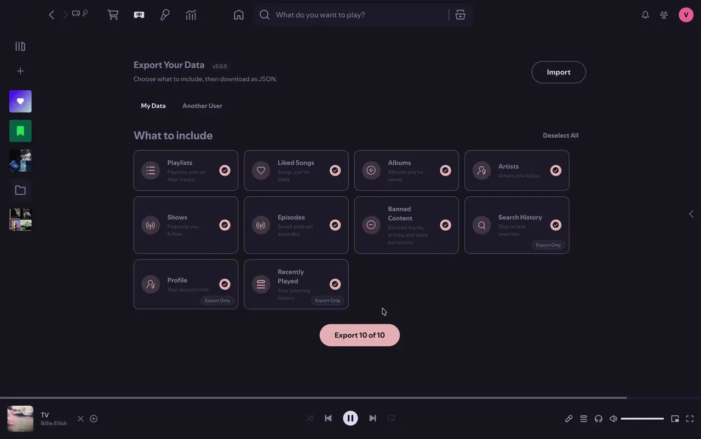

<div align="center">
  <h1>Spicetify Apps</h1>

  <p>Custom apps for the <a href="https://spicetify.app">Spotify desktop client</a>, powered by Spicetify.</p>

  <p>
    <a href="https://github.com/Prog-Jacob/spicetify-apps/releases"></a>
    <a href="https://github.com/Prog-Jacob/spicetify-apps/releases"></a>
    <a href="LICENSE"></a>
  </p>

<a href="https://github.com/Prog-Jacob/spicetify-apps/releases" title="Latest release">Releases</a>
<span>&nbsp;&middot;&nbsp;</span>
<a href="https://github.com/Prog-Jacob/spicetify-apps/issues" title="Report a bug">Issues</a>
<span>&nbsp;&middot;&nbsp;</span>
<a href="#development" title="Contributing">Development</a>

<br /><br />

</div>

## Data Porter

> Export and import your Spotify library: playlists, liked songs, albums, artists, podcasts, and more.

<a href="apps/data-porter"></a>

<p align="center">
  <a href="apps/data-porter">View README</a>
  <span>&nbsp;&middot;&nbsp;</span>
  <a href="https://github.com/Prog-Jacob/spicetify-apps/releases?q=data-porter">Download</a>
</p>

---

## Constellation

> A graph view of your Spotify universe: songs, artists, albums, playlists, and people, drawn from the relationships already in your library.

<a href="apps/constellation"></a>

<p align="center">
  <a href="apps/constellation">View README</a>
  <span>&nbsp;&middot;&nbsp;</span>
  <a href="https://github.com/Prog-Jacob/spicetify-apps/releases?q=constellation">Download</a>
</p>

---

## Development

A pnpm monorepo. Apps run inside Spotify's Chromium shell and use React provided by the `Spicetify` global (React is not bundled, it's externalized to `Spicetify.React`).

### Prerequisites

- [Node.js](https://nodejs.org/) &ge; 22
- [pnpm](https://pnpm.io/) &ge; 11
- [Spicetify](https://spicetify.app/docs/advanced-usage/installation)

### Quick Start

```sh
git clone https://github.com/Prog-Jacob/spicetify-apps.git
cd spicetify-apps
pnpm install
pnpm dev
```

### Commands

| Command                   | What it does                           |
| ------------------------- | -------------------------------------- |
| `pnpm dev`                | Watch-build all apps + live reload     |
| `pnpm build`              | Production build (all apps)            |
| `pnpm build:app <name>`   | Build a single app                     |
| `pnpm typecheck`          | Typecheck all packages                 |
| `pnpm lint`               | ESLint (flat config)                   |
| `pnpm test`               | Run tests (`node:test` via tsx)        |
| `pnpm format`             | Prettier                               |
| `pnpm precommit`          | Format + lint + typecheck + test       |
| `pnpm create-app`         | Scaffold a new app interactively       |
| `pnpm release <app-name>` | Changeset release: bump, tag, push     |
| `pnpm setup-fork`         | Repoint all repo references for a fork |

### Project Structure

```
apps/<name>/
├── src/
│   ├── index.tsx            Entry point (default-exports render() returning JSX)
│   ├── app.tsx              App shell (error boundary, i18n, layout)
│   └── i18n/                Translations (en.ts default + optional locale JSON)
├── preview/                 Screenshots and GIFs for the README
└── dist/                    Build output (index.js, style.css, manifest.json)
packages/
├── shared/                  API wrappers, i18n engine, hooks, types, utilities
└── ui/                      Shared UI components (shadcn/radix, Tailwind v4)
scripts/
├── lib.mts                  Shared constants and helpers for all scripts
├── build.mts                esbuild bundler (auto-discovers apps in apps/)
├── create-app.mts           Interactive app scaffolder
├── setup-fork.mts           Repoints all repo references for forks
└── release.mts              Changeset-based release per app
```

### Adding a New App

```sh
pnpm create-app
```

The scaffolder generates the entry point, app shell, i18n setup, README, `package.json`, and `tsconfig.json`. It also adds a manifest entry. Apps are auto-discovered by the build script, so no extra wiring is needed.

To set up manually, create `apps/<name>/src/index.tsx` with a default `render()` export, a `package.json` with a `version` field, and a `tsconfig.json` extending `../../tsconfig.base.json`.

### Path Aliases

| Alias       | Resolves to             |
| ----------- | ----------------------- |
| `@shared/*` | `packages/shared/src/*` |
| `@ui/*`     | `packages/ui/src/*`     |

### Releases

Uses [changesets](https://github.com/changesets/changesets). Tags follow `<app-name>-v<version>` format.

```sh
pnpm release data-porter
```

### Forking This Repo

The repo is designed so forks can publish their own apps with minimal setup. Most scripts derive the repo identity from `package.json#repository` at build time, so a single edit propagates everywhere: generated READMEs, update checks, i18n locale fetching, and install commands inside app bundles.

After forking, run the setup script to point everything at your repo:

```sh
pnpm setup-fork
```

This updates `package.json#repository`, install scripts, and all README badge/link URLs in one step. Everything else (build, release, scaffolder, CI workflows, changesets) works out of the box.

---

<p align="center"><sub>MIT License &copy; 2026 Ahmed Abdelaziz</sub></p>
