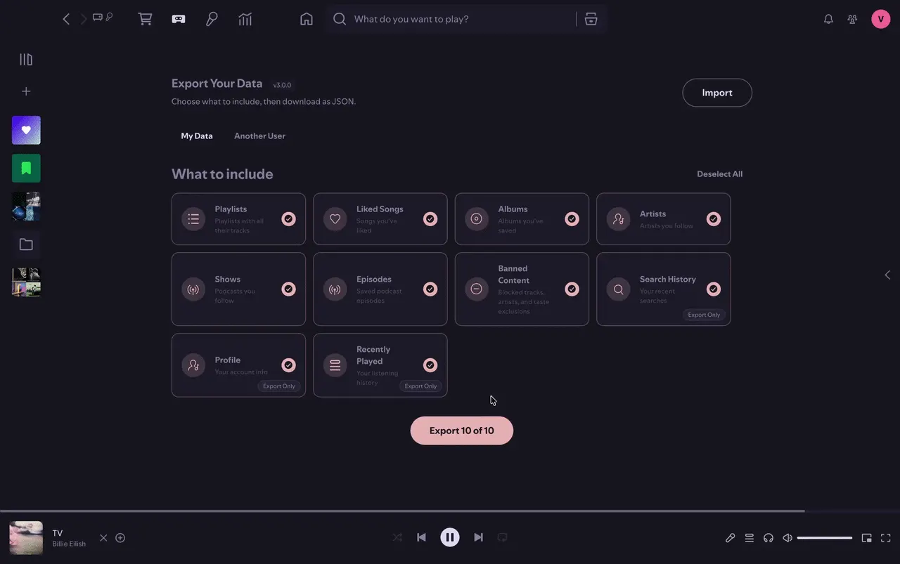
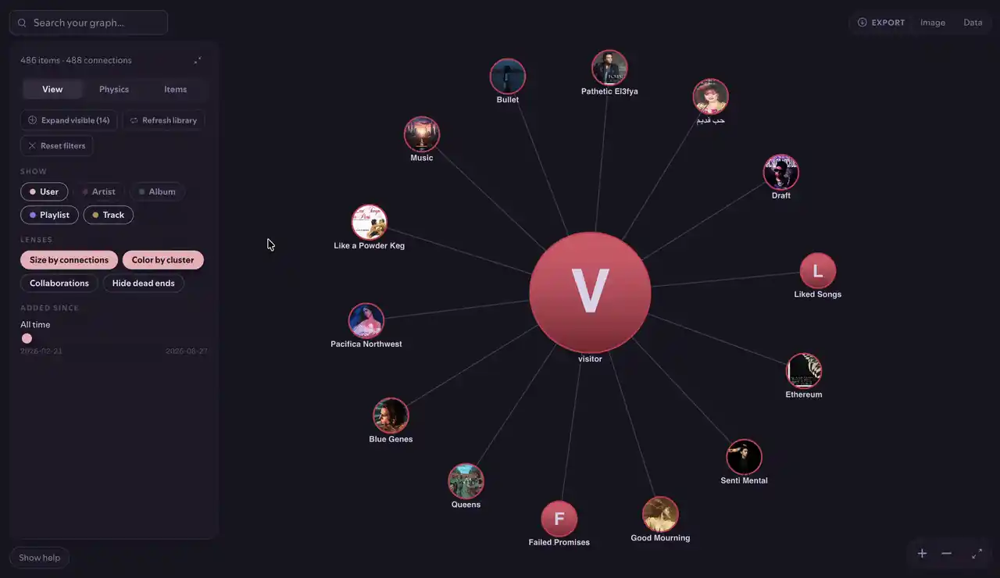

<div align="center">
  <h1>Spicetify Apps</h1>

  <p>Custom apps for the <a href="https://spicetify.app">Spotify desktop client</a>, powered by Spicetify.</p>

  <p>
    <a href="https://github.com/Prog-Jacob/spicetify-apps/releases"></a>
    <a href="https://github.com/Prog-Jacob/spicetify-apps/releases"></a>
    <a href="LICENSE"></a>
  </p>

<a href="#apps">Apps</a>
<span>&nbsp;&middot;&nbsp;</span>
<a href="#install">Install</a>
<span>&nbsp;&middot;&nbsp;</span>
<a href="#build-your-own">Build your own</a>
<span>&nbsp;&middot;&nbsp;</span>
<a href="https://github.com/Prog-Jacob/spicetify-apps/issues">Issues</a>

<br /><br />

</div>

## Apps

### Data Porter

Export and import your Spotify library: playlists, liked songs, albums, artists, podcasts, and more.

<a href="apps/data-porter"></a>

<p align="center"><a href="apps/data-porter">Read more</a></p>

### Constellation

A graph of your Spotify universe: songs, artists, albums, playlists, and people, drawn from your library.

<a href="apps/constellation"></a>

<p align="center"><a href="apps/constellation">Read more</a></p>

## Install

You need [Spicetify](https://spicetify.app/docs/advanced-usage/installation). Replace `data-porter` with `constellation` for the other app.

**macOS / Linux**

```sh
curl -fsSL https://raw.githubusercontent.com/Prog-Jacob/spicetify-apps/main/install.sh | bash -s data-porter
```

**Windows (PowerShell)**

```powershell
iex "& { $(iwr -useb https://raw.githubusercontent.com/Prog-Jacob/spicetify-apps/main/install.ps1) } data-porter"
```

Run the same command again to update. Apps also tell you in-app when a new version is out.

## Build your own

This repo is a starting point for your own Spicetify apps. It comes with a shared library (Spotify API wrappers, hooks, i18n, themed UI components) so a new app starts working, not empty.

**Requirements:** Node.js 22+, pnpm 11+, Spicetify.

```sh
git clone https://github.com/Prog-Jacob/spicetify-apps.git
cd spicetify-apps
pnpm install
pnpm dev          # opens Spotify with the apps loaded and rebuilds on save
```

| I want to                    | Run                     |
| ---------------------------- | ----------------------- |
| Create a new app             | `pnpm create-app`       |
| Build one app                | `pnpm build:app <name>` |
| Check before committing      | `pnpm precommit`        |
| Release an app               | `pnpm release <name>`   |
| Make a fork publish as yours | `pnpm setup-fork`       |

**New app:** `pnpm create-app` asks for a name and description, then creates a working starter in `apps/<name>/`. Run `pnpm dev` and it appears in Spotify's sidebar.

**Fork:** `pnpm setup-fork` points links, update checks and install commands at your repo and sets you as the author. It can also remove the existing apps.

**Release:** `pnpm release <name>` from a clean `main` bumps the version, tags it and pushes. GitHub Actions builds and publishes the release.

**Translations:** each app has `src/i18n/en.ts`; add a language as `<locale>.json` with the same keys.

For the code map, shared building blocks and conventions, see [CLAUDE.md](CLAUDE.md).

---

<p align="center"><sub>MIT License &copy; 2026 Ahmed Abdelaziz</sub></p>
