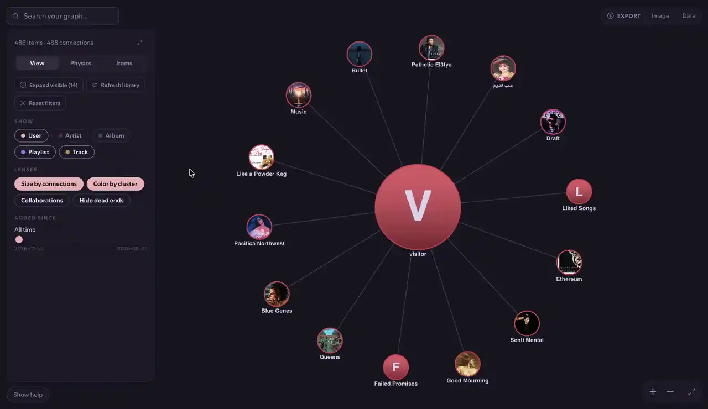
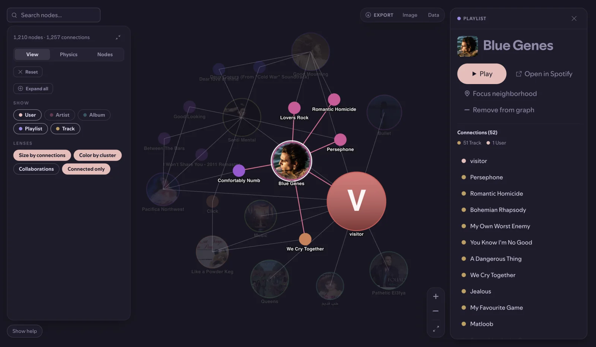

<div align="center">
  <a href="https://github.com/Prog-Jacob/spicetify-apps/releases?q=constellation">
    
  </a>

  <br />

  <h1>Constellation</h1>

  <p><strong>A graph view of your Spotify universe: songs, artists, albums, playlists, and people, drawn from the relationships already in your library.</strong></p>

  <p>
    <a href="https://github.com/Prog-Jacob/spicetify-apps/releases?q=constellation"></a>
    <a href="https://github.com/Prog-Jacob/spicetify-apps/releases?q=constellation"></a>
  </p>

<a href="#install">Install</a>
<span>&nbsp;&middot;&nbsp;</span>
<a href="#features">Features</a>
<span>&nbsp;&middot;&nbsp;</span>
<a href="https://github.com/Prog-Jacob/spicetify-apps/issues">Report a Bug</a>

<br /><br />

</div>

## Features

Constellation renders your library as an interactive, Obsidian-style graph. Nodes are your
tracks, artists, albums, playlists, and the people you follow; edges are the relationships
Spotify already stores: who performed a track, which album it's on, who made a playlist,
what you've saved. Entities render as avatars using their real artwork, sized by how
connected they are.

---

### Explore

- **Click** a node to open the inspector: its connection breakdown, plus actions to play, queue, open in Spotify, or focus its neighborhood.
- **Double-click** a node to expand its connections into the graph.
- **Drag** a node to pin it in place; **hover** to highlight its neighbours.
- **Scroll** or the +/&minus; buttons to zoom, drag the background to pan, and fit the whole graph to view.
- **Search nodes** by name to jump straight to any entity.



---

### Lenses & filters

Open **Controls &rarr; View** to reshape the graph without rebuilding it:

- **Show** chips toggle each node type (User, Artist, Album, Playlist, Track).
- **Size by connections** scales nodes by how linked they are.
- **Color by cluster** tints the communities detected in the graph.
- **Collaborations** surfaces artist-to-artist links.
- **Connected only** hides orphan nodes.
- **Added since** filters to entities you saved after a chosen date.
- **Expand all** pulls connections across the visible graph, with cancellable progress; **Release pins** frees everything you've pinned.

---

### Physics

**Controls &rarr; Physics** tunes the force layout live: **Repulsion**, **Link length**, **Gravity**, and **Node spacing** sliders, plus **Freeze** to lock the layout and **Reset** to return to defaults.

---

### Paths between nodes

**Shift-click** several nodes to select them, then toggle **Paths between** to spotlight the nodes that sit between your picks. A **Reach** slider widens or tightens how far from each pick still counts.

---

### Build your graph

**Controls &rarr; Nodes** grows the graph beyond your own library:

- **Add** any profile, artist, album, or playlist by pasting its Spotify link or URI.
- Friends and followed profiles, along with their public playlists, are crawled in automatically.
- **Remove** anything you don't want, and **Restore** it later from the removed list.

---

### Export

**Export &rarr; Image** saves the current view as a PNG; **Export &rarr; Data** saves the graph as JSON.

---

### More

- **Pins, physics, and view settings persist** between sessions.
- **English and Arabic**, auto-detected from Spotify's language setting.
- **Automatic update check** on launch.

---

## Install

**Linux / macOS:**

```sh
curl -fsSL https://raw.githubusercontent.com/Prog-Jacob/spicetify-apps/main/install.sh | bash -s constellation
```

**Windows (PowerShell):**

```ps1
iex "& { $(iwr -useb https://raw.githubusercontent.com/Prog-Jacob/spicetify-apps/main/install.ps1) } constellation"
```

<details>
<summary><strong>Manual installation</strong></summary>

<br />

Download the zip from the [latest release](https://github.com/Prog-Jacob/spicetify-apps/releases?q=constellation&expanded=true), then place the `constellation` folder into your Spicetify `CustomApps` directory:

```
spicetify/CustomApps
  marketplace/
  constellation/
    index.js
    manifest.json
    style.css
```

Then apply:

```sh
spicetify config custom_apps constellation
spicetify apply
```

</details>

<details>
<summary><strong>Uninstall</strong></summary>

<br />

```sh
spicetify config custom_apps constellation-
spicetify apply
```

Then delete the `constellation` folder from `CustomApps`.

</details>

---

<p align="center">
  <a href="https://github.com/Prog-Jacob/spicetify-apps/issues">Report an Issue</a>
  <span>&nbsp;&middot;&nbsp;</span>
  <a href="CHANGELOG.md">Changelog</a>
  <span>&nbsp;&middot;&nbsp;</span>
  <a href="https://github.com/Prog-Jacob/spicetify-apps/releases?q=constellation&expanded=true">Latest Release</a>
</p>
