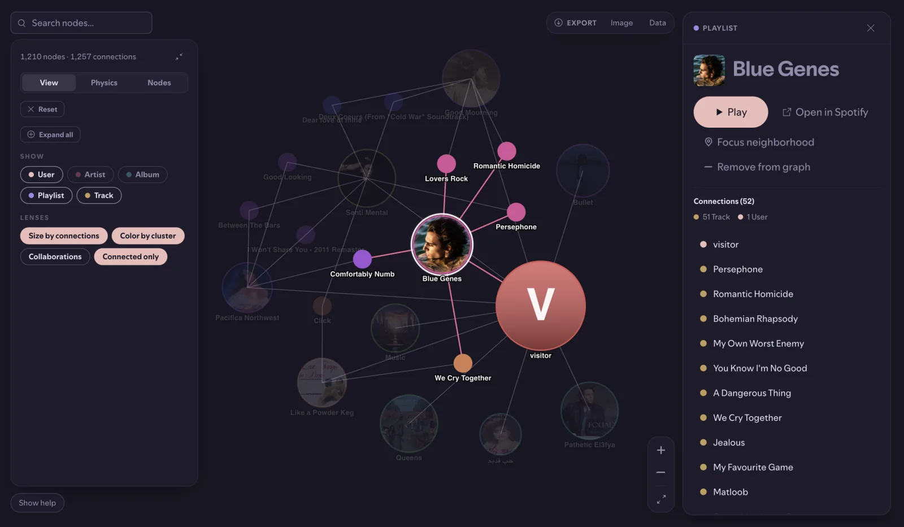

<div align="center">
  <a href="https://github.com/Prog-Jacob/spicetify-apps/releases?q=constellation">
    
  </a>

  <br />

  <h1>Constellation</h1>

  <p><strong>A graph view of your Spotify universe: songs, artists, albums, playlists, and people, drawn from the relationships already in your library.</strong></p>

  <p>
    <a href="https://github.com/Prog-Jacob/spicetify-apps/releases?q=constellation"></a>
    <a href="https://github.com/Prog-Jacob/spicetify-apps/releases?q=constellation"></a>
  </p>

<a href="#install">Install</a>
<span>&nbsp;&middot;&nbsp;</span>
<a href="#explore">Explore</a>
<span>&nbsp;&middot;&nbsp;</span>
<a href="#controls">Controls</a>
<span>&nbsp;&middot;&nbsp;</span>
<a href="https://github.com/Prog-Jacob/spicetify-apps/issues">Report a Bug</a>

<br /><br />

</div>

**Which artist links your two favorite playlists? How does a friend's playlist lead to an album you love?** Constellation draws your library as a graph, like Obsidian does for notes, and lets you see the answer.

- **Items** are your tracks, artists, albums, playlists, and the people you follow. Each one shows its real artwork.
- **Links** are facts Spotify already stores: who plays a track, which album holds it, who made a playlist, what you saved.
- **Size** grows with the number of links.

## Explore

| To                       | Do this                                       |
| ------------------------ | --------------------------------------------- |
| Inspect an item          | Click it                                      |
| Pull in its links        | Double-click it                               |
| Pin it in place          | Drag it                                       |
| Highlight its neighbours | Hover over it                                 |
| Open it in Spotify       | Right-click it                                |
| Select it for a path     | Shift-click it                                |
| Zoom / pan               | Scroll or use +/&minus; / drag the background |
| Jump to an item          | Type its name in search, then press Enter     |

The inspector shows an item's links by type. From there you can play, queue, open, expand, or show only its neighbourhood.

**Liked Songs** is a playlist like any other. Double-click it to bring in your saved tracks.



## Paths between items

Shift-click two or more items, then turn on **Paths between**. Only the items on a route from one pick to another stay.

The result is exact. An item stays only if a route passes through it without going back. A playlist that hangs off one pick does not count as a link. The **Detour** slider allows routes that are longer than the shortest one, in extra hops.

## Controls

Open **Controls** for three tabs.

<details open>
<summary><strong>View: change what you see</strong></summary>

<br />

| Control                 | Effect                                                         |
| ----------------------- | -------------------------------------------------------------- |
| **Show**                | Turn each type on or off: User, Artist, Album, Playlist, Track |
| **Size by connections** | Make well-linked items larger                                  |
| **Color by cluster**    | Color each group of closely linked items                       |
| **Collaborations**      | Show links between artists who work together                   |
| **Hide dead ends**      | Hide items with fewer than two visible links                   |
| **Added since**         | Show only items you saved after a date                         |
| **Expand visible**      | Pull in links for every visible item. You can cancel.          |
| **Refresh library**     | Read your library again without a Spotify restart              |
| **Release pins**        | Free every pinned item                                         |

</details>

<details>
<summary><strong>Physics: tune the layout</strong></summary>

<br />

Sliders for **Repulsion**, **Link length**, **Gravity** and **Spacing** change the layout live. **Freeze** stops all movement. **Reset** sets the defaults again.

</details>

<details>
<summary><strong>Items: grow or trim the graph</strong></summary>

<br />

- **Add** a profile, artist, album, or playlist. Paste its Spotify link or URI.
- **Friends** and the profiles you follow come in by themselves, with their public playlists.
- **Remove** an item. Items you can reach only through it go too. To keep a type, clear it under **Also remove connected**.
- **Undo** a removal at once, or **Restore** the full branch later, with its links. Your own item always stays.

</details>

## Export

**Export &rarr; Image** saves the view as `constellation.png`. **Export &rarr; Data** saves the graph as `constellation.json`. Both go to your Downloads folder.

## More

- **Fast return.** Your last graph opens at once. After 6 hours, the app reads your library again in the background and keeps your expansions.
- **Your setup stays.** Pins, physics and view settings are kept between sessions.
- **English and Arabic.** The app follows Spotify's language setting.
- **Update banner** when a new version is out.

## Install

You need [Spicetify](https://spicetify.app/docs/advanced-usage/installation). Run the line again to update.

**macOS / Linux**

```sh
curl -fsSL https://raw.githubusercontent.com/Prog-Jacob/spicetify-apps/main/install.sh | bash -s constellation
```

**Windows (PowerShell)**

```ps1
iex "& { $(iwr -useb https://raw.githubusercontent.com/Prog-Jacob/spicetify-apps/main/install.ps1) } constellation"
```

<details>
<summary><strong>Manual installation</strong></summary>

<br />

1. Download the zip from the [latest release](https://github.com/Prog-Jacob/spicetify-apps/releases?q=constellation&expanded=true).
2. Put the `constellation` folder in your Spicetify `CustomApps` folder:

   ```
   spicetify/CustomApps/
     constellation/
       index.js
       manifest.json
       style.css
   ```

3. Turn it on:

   ```sh
   spicetify config custom_apps constellation
   spicetify apply
   ```

</details>

<details>
<summary><strong>Uninstall</strong></summary>

<br />

```sh
spicetify config custom_apps constellation-
spicetify apply
```

Then delete the `constellation` folder from `CustomApps`.

</details>

---

<p align="center">
  <a href="https://github.com/Prog-Jacob/spicetify-apps/issues">Report an Issue</a>
  <span>&nbsp;&middot;&nbsp;</span>
  <a href="CHANGELOG.md">Changelog</a>
  <span>&nbsp;&middot;&nbsp;</span>
  <a href="https://github.com/Prog-Jacob/spicetify-apps/releases?q=constellation&expanded=true">Latest Release</a>
</p>
