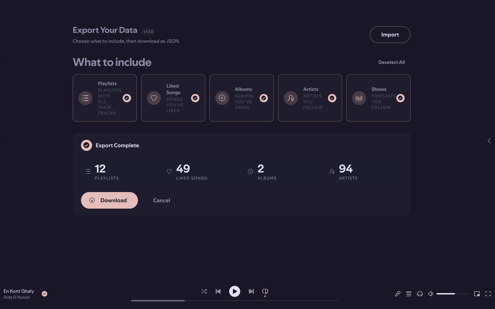
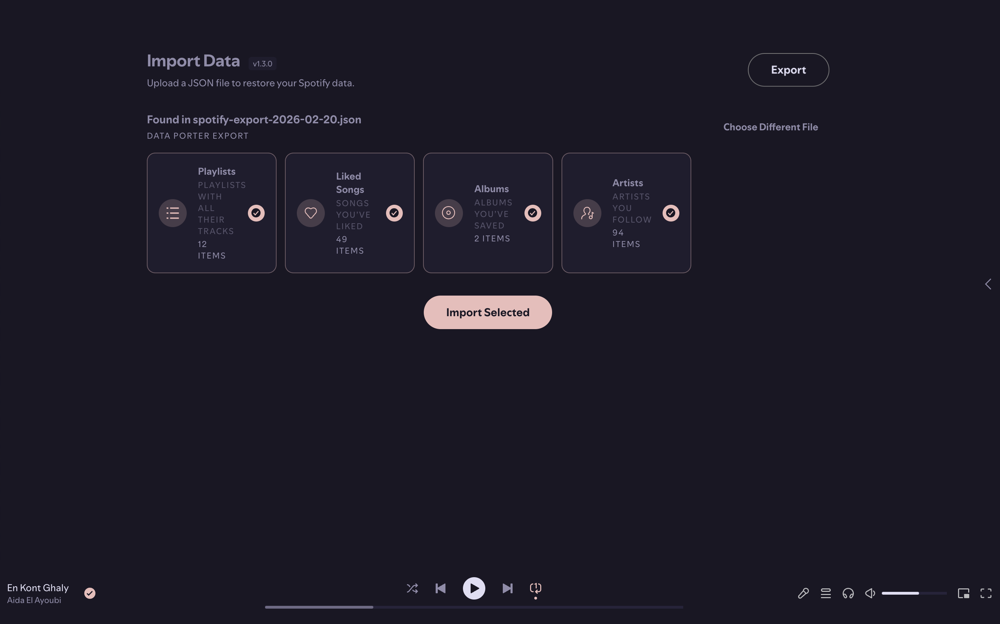
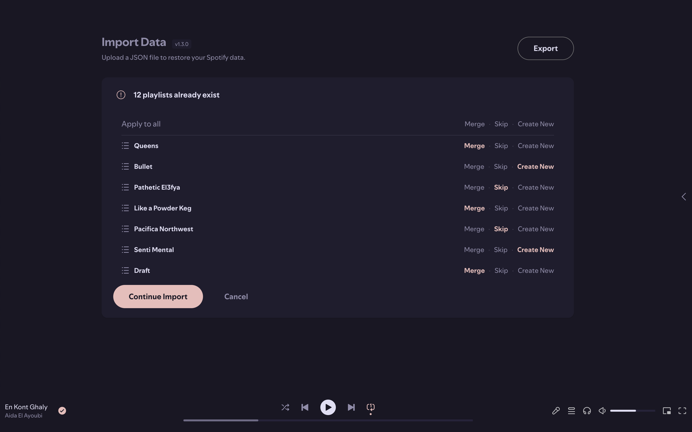

# Data Porter

A Spicetify custom app to export and import your Spotify library data.

## Preview

### Export
- Pick individual data types — playlists, liked songs, albums, artists, podcasts
- Select all or deselect all in one click



### Import
- Drag and drop or browse for a file
- Preview item counts per type before committing



### Conflict Resolution
- Per-playlist choice: skip, replace, or duplicate
- Apply a resolution to all conflicts at once



### What it does

- **Export** playlists (with tracks), liked songs, saved albums, followed artists, and podcasts to a single JSON file
- **Import** data back from a Data Porter export or a Spotify official data export
- Detects playlist conflicts and lets you skip, replace, or create duplicates
- Progress tracking with cancel support

---

### Installation (Linux / macOS)

```sh
curl -fsSL https://raw.githubusercontent.com/Prog-Jacob/spicetify-apps/main/install.sh | bash -s data-porter
```

### Installation (Windows, PowerShell)

```ps1
iex "& { $(iwr -useb https://raw.githubusercontent.com/Prog-Jacob/spicetify-apps/main/install.ps1) } data-porter"
```

### Manual Installation

Download the zip from the [latest release](https://github.com/Prog-Jacob/spicetify-apps/releases?q=data-porter&expanded=true), then place the `data-porter` folder into your Spicetify `CustomApps` directory:

```
spicetify/CustomApps
  marketplace/
  data-porter/
    index.js
    manifest.json
    style.css
```

Then apply:

```sh
spicetify config custom_apps data-porter
spicetify apply
```

### Uninstallation

```sh
spicetify config custom_apps data-porter-
spicetify apply
```

To fully remove, delete the `data-porter` folder from `CustomApps` after running the above.

---

If you run into issues, please [open an issue](https://github.com/Prog-Jacob/spicetify-apps/issues) with your Spicetify version and installation method.
