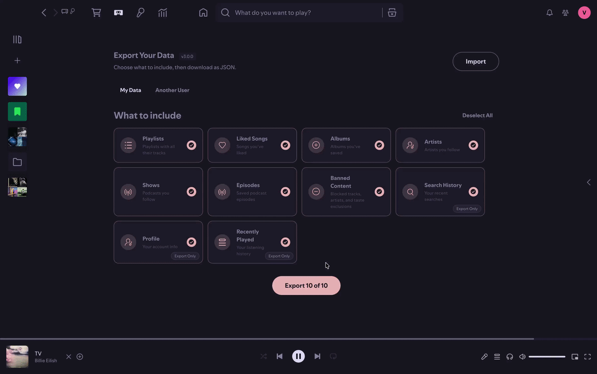

# Data Porter

Back up your Spotify library, move it to another account, or just keep a copy for peace of mind.



## Features

### Export

Pick what you want to include, then download it all as a single JSON file.

| Data             | Importable | Notes                                                            |
| ---------------- | :--------: | ---------------------------------------------------------------- |
| Playlists        |    Yes     | Includes folder-nested playlists, tracks, episodes, descriptions |
| Liked Songs      |    Yes     |                                                                  |
| Albums           |    Yes     |                                                                  |
| Artists          |    Yes     |                                                                  |
| Shows / Podcasts |    Yes     |                                                                  |
| Episodes         |    Yes     | Saved podcast episodes ("Your Episodes")                         |
| Banned Content   |    Yes     | Blocked tracks and artists                                       |
| Recently Played  |     --     | ~3 months of listening history (music and podcasts)              |
| Search History   |     --     | Up to 50 recent searches                                         |
| Profile          |     --     | Display name, username, country, subscription tier               |

You can also export another user's public playlists and followed artists. Just paste their profile URL or user ID.

### Import

Drop in a JSON file to restore your data. Works with Data Porter exports and Spotify's official data exports (YourLibrary.json, Playlist1.json).

You'll see a preview of what's inside before anything gets written.


### Conflict Resolution

Already have a playlist with the same name? You get to choose: skip it, merge the tracks, or create a fresh copy. You can also apply one choice to all conflicts at once.


### More

- English and Arabic, auto-detected from Spotify's language setting

## Known Limitations

- **Local tracks are skipped.** Spotify doesn't allow adding local files programmatically.
- **Some episodes from Spotify's official export can't be matched.** If they're missing URIs, they're skipped.
- **Max file size is 20 MB.**

## Install

**Linux / macOS:**

```sh
curl -fsSL https://raw.githubusercontent.com/Prog-Jacob/spicetify-apps/main/install.sh | bash -s data-porter
```

**Windows (PowerShell):**

```ps1
iex "& { $(iwr -useb https://raw.githubusercontent.com/Prog-Jacob/spicetify-apps/main/install.ps1) } data-porter"
```

<details>
<summary>Manual installation</summary>

Download the zip from the [latest release](https://github.com/Prog-Jacob/spicetify-apps/releases?q=data-porter&expanded=true), then place the `data-porter` folder into your Spicetify `CustomApps` directory:

```
spicetify/CustomApps
  marketplace/
  data-porter/
    index.js
    manifest.json
    style.css
```

Then apply:

```sh
spicetify config custom_apps data-porter
spicetify apply
```

</details>

<details>
<summary>Uninstall</summary>

```sh
spicetify config custom_apps data-porter-
spicetify apply
```

Then delete the `data-porter` folder from `CustomApps`.

</details>

---

[Report an issue](https://github.com/Prog-Jacob/spicetify-apps/issues) · [Changelog](CHANGELOG.md) · [Latest release](https://github.com/Prog-Jacob/spicetify-apps/releases?q=data-porter&expanded=true)
