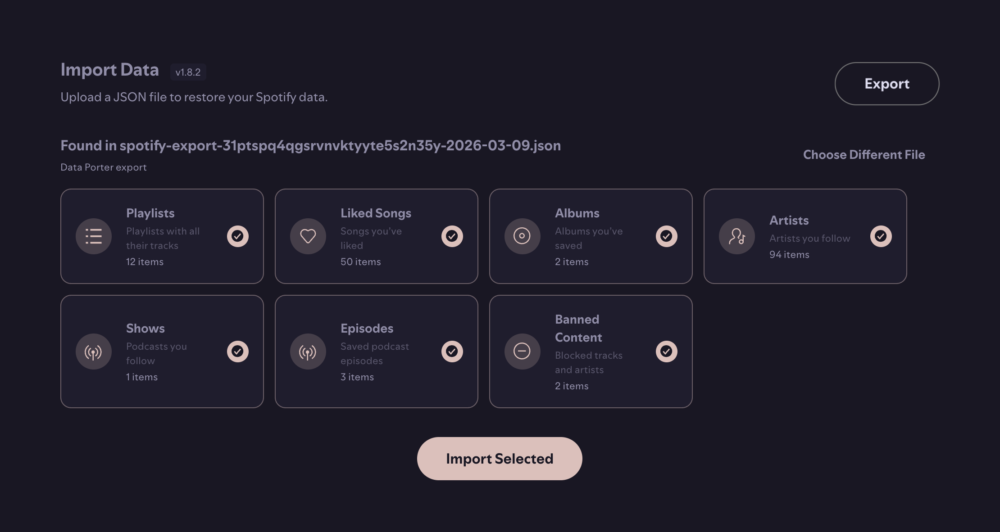
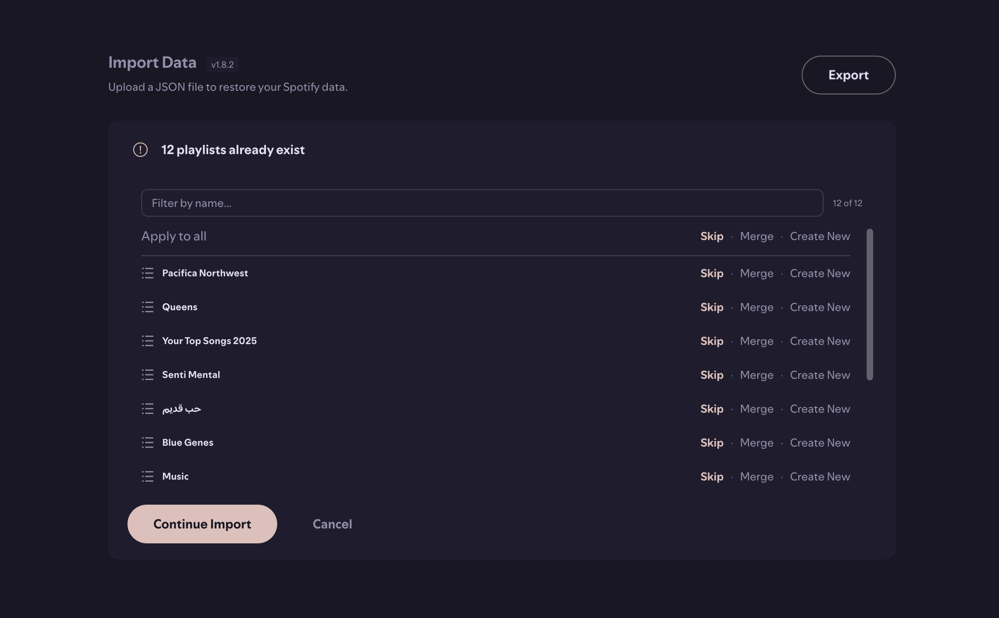

<div align="center">
  <a href="https://github.com/Prog-Jacob/spicetify-apps/releases?q=data-porter">
    
  </a>

  <br />

  <h1>Data Porter</h1>

  <p><strong>Back up, export, import, transfer, and migrate your Spotify library: playlists, liked songs, albums, artists, and podcasts. Move it to another account or save it as a portable JSON file.</strong></p>

  <p>
    <a href="https://github.com/Prog-Jacob/spicetify-apps/releases?q=data-porter"></a>
    <a href="https://github.com/Prog-Jacob/spicetify-apps/releases?q=data-porter"></a>
  </p>

<a href="#install">Install</a>
<span>&nbsp;&middot;&nbsp;</span>
<a href="#export">Export</a>
<span>&nbsp;&middot;&nbsp;</span>
<a href="#import">Import</a>
<span>&nbsp;&middot;&nbsp;</span>
<a href="#limits">Limits</a>
<span>&nbsp;&middot;&nbsp;</span>
<a href="https://github.com/Prog-Jacob/spicetify-apps/issues">Report a Bug</a>

<br /><br />

</div>

**Three steps to move a library:** export on the old account, sign in to the new one, import the file. Data Porter runs inside Spotify, so it needs no login, API key or rate-limit wait.

## Export

Choose what to include. Data Porter saves it all as one JSON file.

| Data            | Can import | What you get                                           |
| --------------- | :--------: | ------------------------------------------------------ |
| Playlists       |     ✓      | Tracks, episodes and descriptions, also inside folders |
| Liked Songs     |     ✓      | Import keeps their original order                      |
| Albums          |     ✓      |                                                        |
| Artists         |     ✓      | Artists you follow                                     |
| Shows           |     ✓      | Podcasts you follow                                    |
| Episodes        |     ✓      | Saved podcast episodes ("Your Episodes")               |
| Banned Content  |     ✓      | Blocked tracks and artists, taste exclusions           |
| Recently Played |     –      | About 3 months of music and podcast history            |
| Search History  |     –      | Up to 50 recent searches                               |
| Profile         |     –      | Display name, username, country, plan                  |

**Another user:** export a friend's public playlists and followed artists. Pick a friend from the list, or paste a profile link or username.

**Preview first:** click the item count on any card. You can search, open a playlist to see its tracks, and page through large lists.

## Import

Give Data Porter one of these:

| Source                         | How                                         |
| ------------------------------ | ------------------------------------------- |
| A Data Porter export           | Drop the file, or paste a link to it        |
| Spotify's official data export | Drop `YourLibrary.json` or `Playlist1.json` |
| A public profile               | Paste the profile link or username          |

Nothing changes until you confirm. First you see what the file holds, and you can open each type to check it.



### Review each playlist

Before Data Porter creates a playlist, you decide what happens to it.

| Playlist               | Your choices                                      |
| ---------------------- | ------------------------------------------------- |
| New to this account    | Create, or Skip                                   |
| Already in the library | Skip, Merge (add only missing tracks), Create New |

Apply one choice to all playlists, or choose one by one. Filter by name to find a playlist.



- **Private by default.** Every imported playlist is private.
- **Safe to cancel.** The summary lists what was added before you stopped. Those items stay.

## Limits

- **Local files are skipped.** Spotify has no API to add local files.
- **Some episodes from Spotify's official export are skipped.** That export leaves out the URI for some episodes. The log names each one.
- **Files over 20 MB are refused.**

## More

- English and Arabic. The app follows Spotify's language setting.
- An update banner shows when a new version is out.

## Install

You need [Spicetify](https://spicetify.app/docs/advanced-usage/installation). Run the line again to update.

**macOS / Linux**

```sh
curl -fsSL https://raw.githubusercontent.com/Prog-Jacob/spicetify-apps/main/install.sh | bash -s data-porter
```

**Windows (PowerShell)**

```ps1
iex "& { $(iwr -useb https://raw.githubusercontent.com/Prog-Jacob/spicetify-apps/main/install.ps1) } data-porter"
```

<details>
<summary><strong>Manual installation</strong></summary>

<br />

1. Download the zip from the [latest release](https://github.com/Prog-Jacob/spicetify-apps/releases?q=data-porter&expanded=true).
2. Put the `data-porter` folder in your Spicetify `CustomApps` folder:

   ```
   spicetify/CustomApps/
     data-porter/
       index.js
       manifest.json
       style.css
   ```

3. Turn it on:

   ```sh
   spicetify config custom_apps data-porter
   spicetify apply
   ```

</details>

<details>
<summary><strong>Uninstall</strong></summary>

<br />

```sh
spicetify config custom_apps data-porter-
spicetify apply
```

Then delete the `data-porter` folder from `CustomApps`.

</details>

---

<p align="center">
  <a href="https://github.com/Prog-Jacob/spicetify-apps/issues">Report an Issue</a>
  <span>&nbsp;&middot;&nbsp;</span>
  <a href="CHANGELOG.md">Changelog</a>
  <span>&nbsp;&middot;&nbsp;</span>
  <a href="https://github.com/Prog-Jacob/spicetify-apps/releases?q=data-porter&expanded=true">Latest Release</a>
</p>
